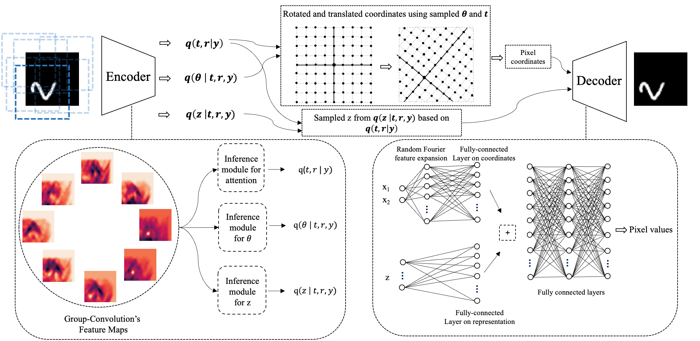

# TARGET-VAE

Source code for <a href=""> Unsupervised Object Representation Learning using Translation and Rotation Group Equivariant VAE </a>




## Setup
Dependencies
<ul>
<li> Python 3 </li>
<li> Pytorch >= 1.11 </li>
<li> torchvision >= 0.12 </li>
<li> numpy >= 1.21 </li>
<li> scikit-learn >= 1.0.2 </li>
<li> astropy >= 5.0.4 </li>
</ul>


## Usage
The code in train_mnist.py, train_particles.py, train_dsprites.py, and train_galaxy.py, train TARGET-VAE on mnist (regular, MNIST(N), MNIST(U)), particle stacks of cryo-EM, dSprites, and galaxies datasets. The scripts with clustering at the start of their names, can be used to apply the trained model for clustering on a specific dataset.

For example to train TARGET-VAE with P8 groupconv and z_dim=2, on the mnist_U dataset (described in the paper):
```
python train_mnist.py -z 2 --dataset mnist-U --t-inf attention --r-inf attention+offsets --groupconv 8 --fourier-expansion
```
, or to train TARGET-VAE with P8 and z_dim=2, on the particle stack saved in the folder 'data/EMPIAR10025/mrcs/':
```
python train_particles.py --train-path data/EMPIAR10025/mrcs -z 2 --t-inf attention --r-inf attention+offsets --groupconv 8 --fourier-expansion
```
